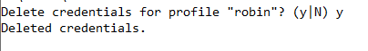

# CRC-AWS vault basic commands

AWS Vault is a tool to securely store and access AWS credentials in a development environment.

AWS Vault stores IAM credentials in your operating system's secure keystore and then generates temporary credentials from those to expose to your shell and applications. It's designed to be complementary to the AWS CLI tools, and is aware of your profiles and configuration in ~/.aws/config. (source: https://github.com/99designs/aws-vault)


Let's take a look at useful aws-vault commands:

  
 

We have an account named Robin for demonstration purposes. She is a friend of Alice and they both like to keep their AWS credentials secure. That's the reason Robin added her IAM user account to aws-vault.


### Adding an account to AWS-vault 

`aws-vault add robin`


### Deleting an account on AWS-vault

`aws-vault remove robin`



### Listing the credentials

`aws-vault list`

### Login with an account

`aws-valult login robin`

### running a command

`aws-vault exec robin aws s3 ls`
`


Keep in mind that you need to configure poermissions to successfully login otherwise you may get an error like this:

```
robin is not authorized to perform: 
iam:GetUser on resource: user robin 
because no identity-based policy allows the 
iam:GetUser action
```


